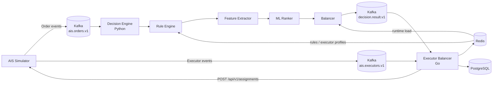
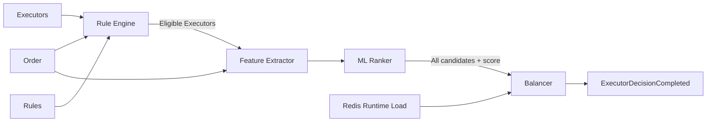
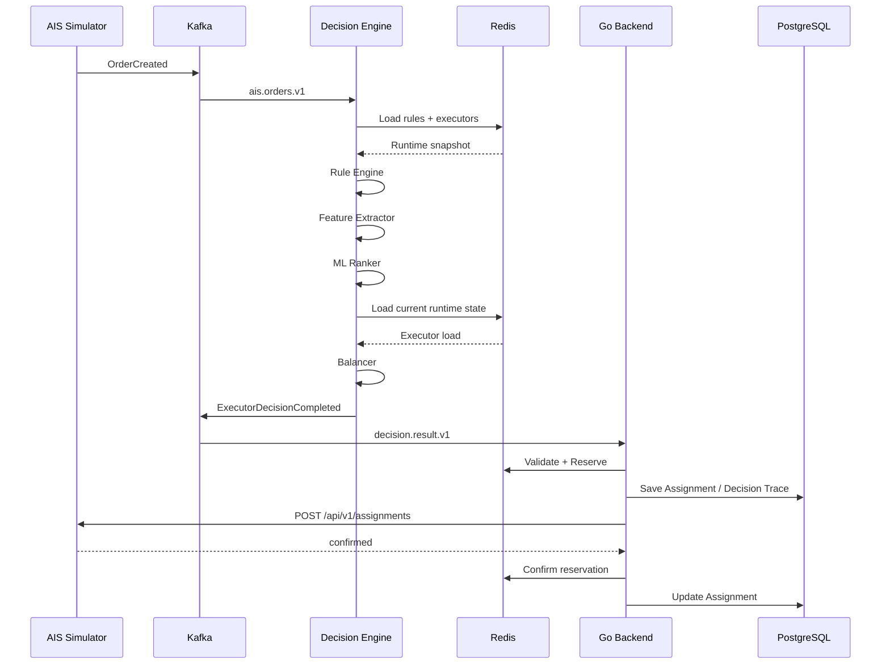
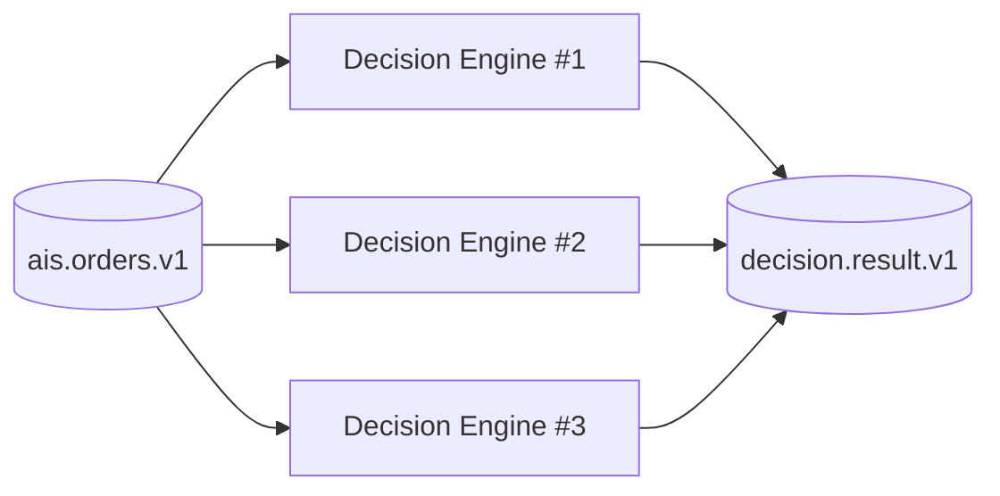

# Executor Balancer

> Интеллектуальная система распределения заявок между исполнителями в реальном времени.

**Executor Balancer** принимает поток заявок из внешней информационной системы, отбирает подходящих исполнителей по строгим бизнес-правилам, извлекает признаки из текста заявки, ранжирует кандидатов с помощью ML и выполняет балансировку с учётом текущей нагрузки.

Система построена на событийной архитектуре и рассчитана на высокую нагрузку, динамические параметры заявок и исполнителей, конкурентную обработку и безопасную фиксацию назначений.

---

## Содержание

- [Основные возможности](#основные-возможности)
- [Архитектура](#архитектура)
- [Компоненты системы](#компоненты-системы)
- [Decision Engine](#decision-engine)
- [Поток обработки заявки](#поток-обработки-заявки)
- [Модель заявки](#модель-заявки)
- [Модель исполнителя](#модель-исполнителя)
- [Kafka](#kafka)
- [Redis](#redis)
- [PostgreSQL](#postgresql)
- [Reservation и идемпотентность](#reservation-и-идемпотентность)
- [Масштабирование](#масштабирование)
- [Запуск проекта](#запуск-проекта)
- [E2E-проверка](#e2e-проверка)
- [Симуляция нагрузки](#симуляция-нагрузки)
- [Запуск отдельных компонентов](#запуск-отдельных-компонентов)
- [Тестирование](#тестирование)
- [Структура репозитория](#структура-репозитория)
- [Технологический стек](#технологический-стек)

---

# Основные возможности

Executor Balancer поддерживает:

- обработку заявок в реальном времени;
- Kafka-based event-driven архитектуру;
- динамические параметры заявок и исполнителей;
- динамические правила распределения;
- строгую фильтрацию через Rule Engine;
- анализ текста заявок;
- semantic matching заявки и навыков исполнителей;
- ML-ранжирование кандидатов;
- балансировку по фактической runtime-нагрузке;
- относительную пропускную способность исполнителей;
- суточные лимиты;
- учёт активных и pending-заявок;
- атомарное резервирование исполнителей;
- защиту от повторной обработки Kafka-событий;
- идемпотентные назначения;
- обработку задержек ответа внешней AIS;
- повторные заявки через `parent_id`;
- Decision Trace;
- генерацию постоянной и burst-нагрузки;
- горизонтальное масштабирование Decision Engine.

---

# Архитектура

## Общая схема



Архитектура разделяет вычислительную и инфраструктурную части.

### AIS Simulator

Источник исходных данных:

- заявки;
- исполнители;
- параметры исполнителей;
- skills;
- бизнес-статусы заявок.

### Decision Engine

Отвечает непосредственно за принятие решения:

```text
Rule Engine
    ↓
Feature Extractor
    ↓
ML Ranker
    ↓
Balancer
```

### Go Backend

Отвечает за согласованность и инфраструктуру:

```text
Kafka
PostgreSQL
Redis
Reservation
Decision Trace
AIS Integration
```

---

# Компоненты системы

## AIS Simulator

Каталог:

```text
simulation/
```

AIS Simulator эмулирует внешнюю автоматизированную информационную систему.

Он предоставляет:

- CRUD заявок;
- CRUD исполнителей;
- Kafka events;
- assignment API;
- генерацию заявок;
- lifecycle заявок;
- изменение параметров исполнителей;
- изменение активности исполнителей;
- повторные заявки;
- нагрузочное тестирование.

Сервис реализован на **FastAPI**.

Внутреннее состояние AIS Simulator хранится в SQLite и полностью изолировано от баз Executor Balancer.

Swagger UI:

```text
http://localhost:8091/docs
```

---

## Backend

Каталог:

```text
backend/
```

Backend реализован на **Go**.

Основные обязанности:

- потребление событий AIS;
- сохранение состояния в PostgreSQL;
- обновление Redis;
- хранение активных исполнителей;
- хранение правил;
- получение решений Decision Engine;
- валидация кандидатов;
- reservation;
- Decision Trace;
- отправка назначения в AIS;
- обработка ошибок AIS;
- подтверждение или отмена reservation;
- защита от повторных Kafka events.

Health endpoints:

```text
GET /health
GET /ready
```

Локально:

```text
http://localhost:8090/health
http://localhost:8090/ready
```

`/ready` проверяет доступность инфраструктурных зависимостей.

---

# Decision Engine

Каталог:

```text
decision-engine/
```

Decision Engine представляет собой Python pipeline выбора исполнителя.



Decision Engine состоит из четырёх основных стадий.

---

## Rule Engine

Модуль:

```text
decision_engine.rule_engine
```

Rule Engine выполняет **hard filtering**.

Его задача:

> определить, можно ли назначить конкретного исполнителя на конкретную заявку.

Примеры условий:

- исполнитель активен;
- не превышен суточный лимит;
- поддерживается необходимый тип заявки;
- поддерживается регион;
- допустима сумма заявки;
- разрешён VIP;
- совпадает категория клиента;
- выполняются пользовательские динамические правила.

Поддерживаются основные операторы:

```text
=
!=
>
>=
<
<=
IN
NOT IN
BETWEEN
CONTAINS
```

Динамические правила позволяют изменять логику распределения без изменения кода Decision Engine.

---

## Feature Extractor

Модуль:

```text
decision_engine.feature_extractor
```

Feature Extractor формирует признаки заявки и исполнителей для ML Ranker.

Он работает с:

- структурированными параметрами;
- текстом заявки;
- skills исполнителей;
- semantic similarity;
- classifier-признаками.

Используемые технологии:

```text
Transformers
Sentence Transformers
PyTorch
KeyBERT
langdetect
```

Semantic matching позволяет учитывать новые skills без изменения программной логики.

Например:

```json
{
    "skills": ["Python", "PostgreSQL", "Docker"]
}
```

Добавление нового навыка исполнителю автоматически влияет на его semantic score относительно текста заявки.

---

## ML Ranker

Модуль:

```text
decision_engine.ml_ranker
```

ML Ranker выполняет **soft ranking**.

На вход он получает всех исполнителей, прошедших Rule Engine.

На выходе каждому исполнителю присваиваются:

```text
ml_score
ml_rank
```

ML Ranker не удаляет кандидатов.

То есть выполняется инвариант:

```text
Rule Engine eligible set
        =
ML Ranker output set
```

Меняется только порядок кандидатов.

Для ранжирования используется **CatBoost**.

Decision Engine также поддерживает heuristic ranker для локальных сценариев.

---

## Balancer

Модуль:

```text
decision_engine.balancer
```

Balancer отвечает за справедливое распределение нагрузки.

Он учитывает:

```text
capacity
current_load
active_count
pending_count
processed_today
last_assignment_at
ml_score
```

Основной показатель:

```text
effective_load = current_load / capacity
```

где:

```text
current_load =
active_weight
+
pending_weight
```

`capacity` отражает относительную пропускную способность исполнителя.

Например:

```text
Executor A
capacity = 1.0
current_load = 6

effective_load = 6


Executor B
capacity = 2.0
current_load = 6

effective_load = 3
```

Несмотря на одинаковую абсолютную нагрузку, второй исполнитель относительно своей capacity загружен меньше.

---

# Поток обработки заявки



Если первый кандидат не может быть зарезервирован, Backend последовательно проверяет следующего кандидата.

---

# Модель заявки

Пример:

```json
{
    "order_id": "order-1032",
    "parent_id": null,
    "status": "processed",
    "weight": 2.0,
    "version": 1,
    "attributes": {
        "sum": 900000,
        "client_msp": "medium",
        "executor_msp": "legal",
        "order_type": "LEGAL_REVIEW",
        "subject": "contract",
        "vip": true,
        "text": "Срочная проверка договора",
        "region": "ural"
    }
}
```

Системные поля находятся на верхнем уровне.

Предметно-зависимые параметры помещаются в:

```json
"attributes": {}
```

Это позволяет добавлять новые параметры без изменения основного event contract.

---

# Модель исполнителя

```json
{
    "executor_id": "executor-28",
    "active": true,
    "capacity": 1.5,
    "daily_limit": 100,
    "version": 3,

    "skills": ["Python", "PostgreSQL", "Docker"],

    "attributes": {
        "min_accept_sum": 0,
        "max_accept_sum": 1000000,

        "client_msp": ["small", "medium"],

        "executor_msp": ["legal"],

        "order_types": ["LEGAL_REVIEW", "CONSULTATION"],

        "subjects": ["contract", "claims"],

        "vip_allowed": true,

        "regions": ["ural", "siberia"]
    }
}
```

### `capacity`

Относительная пропускная способность исполнителя.

### `daily_limit`

Максимальное количество обработанных заявок за день.

`null` означает отсутствие ограничения.

### `skills`

Навыки исполнителя для semantic matching и ML Ranker.

### `attributes`

Динамические бизнес-параметры.

---

# Kafka

Система использует Apache Kafka как основную событийную шину.

| Topic                              | Key           | Назначение              |
| ---------------------------------- | ------------- | ----------------------- |
| `ais.orders.v1`                    | `order_id`    | события заявок          |
| `ais.executors.v1`                 | `executor_id` | события исполнителей    |
| `decision.result.v1`               | `order_id`    | решения Decision Engine |
| `executor-balancer.dead-letter.v1` | event key     | DLQ Backend             |
| `decision-engine.dead-letter.v1`   | event key     | DLQ Decision Engine     |

---

## Event envelope

События AIS используют общий формат:

```json
{
    "event_id": "9ba08c58-4037-4480-a45a-f90a033ab7db",
    "event_type": "OrderCreated",
    "event_version": 1,
    "occurred_at": "2026-09-25T12:00:00Z",
    "source": "ais-simulator",
    "payload": {}
}
```

### Kafka keys

Для заявки:

```text
key = order_id
```

Для исполнителя:

```text
key = executor_id
```

Таким образом события одного объекта попадают в одну partition и сохраняют порядок.

---

# Decision Result

Decision Engine отправляет результат в:

```text
decision.result.v1
```

Пример:

```json
{
    "event_type": "ExecutorDecisionCompleted",
    "event_version": 1,
    "occurred_at": "2026-09-27T10:00:00+00:00",

    "order_id": "order-1032",

    "balanced_candidates": [
        {
            "executor_id": "executor-28",
            "rank": 1,
            "ml_score": 0.82,
            "effective_load": 0.2,
            "capacity": 1.0,
            "active_count": 1,
            "pending_count": 0,
            "processed_today": 5,
            "last_assignment_at": "2026-09-27T09:59:00+00:00"
        }
    ]
}
```

Backend проверяет:

- тип события;
- версию;
- `order_id`;
- уникальность исполнителей;
- корректность rank;
- числовые поля;
- актуальное состояние исполнителя.

После этого кандидаты последовательно проходят reservation.

---

# Redis

Redis используется для runtime-state.

Основные ключи:

```text
executors:active
executor:{executor_id}
rules:active
```

Для активного исполнителя хранится:

```text
capacity
current_load
active_count
pending_count
processed_today
last_assignment_at
```

Redis не является долговременным хранилищем истории.

Он используется как быстрая runtime-проекция для Decision Engine и Backend.

---

# PostgreSQL

PostgreSQL используется для долговременного состояния.

В нём хранятся:

- заявки;
- исполнители;
- skills;
- правила;
- assignments;
- Decision Results;
- Decision Trace;
- processed Kafka events;
- история распределения.

Миграции находятся в:

```text
backend/migrations/
```

---

# Reservation и идемпотентность

Одной из основных проблем распределённого назначения является задержка между выбором исполнителя и подтверждением со стороны AIS.

AIS Simulator имитирует задержку:

```text
2–10 секунд
```

Поэтому система учитывает не только подтверждённую нагрузку, но и pending reservation.

```text
current_load =
confirmed/active load
+
pending load
```

Это позволяет избежать ситуации, когда несколько заявок одновременно распределяются исходя из устаревшей нагрузки.

---

## Assignment

Backend отправляет:

```http
POST /api/v1/assignments
```

Пример:

```json
{
    "assignment_id": "7a44af14-b17b-45e2-8cb9-f17690252e92",
    "order_id": "order-1032",
    "executor_id": "executor-28",
    "decided_at": "2026-09-25T12:00:01Z"
}
```

HTTP header:

```http
Idempotency-Key: 7a44af14-b17b-45e2-8cb9-f17690252e92
```

Повторная отправка того же `assignment_id` не создаёт дополнительное назначение.

---

# Parent orders

Система поддерживает повторные заявки через:

```text
parent_id
```

Например:

```json
{
    "order_id": "order-2002",
    "parent_id": "order-1032"
}
```

Таким образом можно сохранить связь новой итерации заявки с предыдущей.

AIS Simulator поддерживает сценарий:

```text
processed
    ↓
await
    ↓
new OrderCreated
    ↓
parent_id = previous order
```

---

# Масштабирование

Decision Engine масштабируется горизонтально через Kafka consumer groups.



Все экземпляры Decision Engine используют:

```text
KAFKA_CONSUMER_GROUP=decision-engine-v1
```

Kafka автоматически распределяет partitions между consumers.

Так вычислительно тяжёлые операции:

```text
Rule Engine
Feature Extractor
ML Ranker
Balancer
```

могут обрабатываться параллельно для разных заявок.

Согласованность финального назначения обеспечивается Backend и Redis reservation.

---

# Запуск проекта

## Требования

Для полного запуска системы достаточно:

```text
Docker Desktop
Docker Compose
```

Для локального запуска компонентов:

```text
Go 1.25+
Python 3.11+
```

Для Decision Engine рекомендуется:

```text
Python 3.12
```

---

## Quick Start

Клонировать репозиторий:

```bash
git clone https://github.com/NikitaKovalenko111/request-ranging.git

cd request-ranging

git checkout develop
```

Запустить всю систему:

```bash
docker compose up --build -d
```

Проверить контейнеры:

```bash
docker compose ps
```

---

## Адреса

| Компонент         | Адрес                          |
| ----------------- | ------------------------------ |
| AIS Simulator     | `http://localhost:8091`        |
| Swagger AIS       | `http://localhost:8091/docs`   |
| Backend           | `http://localhost:8090`        |
| Backend health    | `http://localhost:8090/health` |
| Backend readiness | `http://localhost:8090/ready`  |
| Frontend           | `http://localhost:8080`        |
| Kafka             | `localhost:9092`               |
| Redis             | `localhost:6380`               |
| PostgreSQL        | `localhost:5442`               |

---

## Остановка

```bash
docker compose down
```

---

## Полный сброс состояния

```bash
docker compose down -v
docker compose up --build -d
```

---

# E2E-проверка

Для проверки полного контура используется:

```powershell
scripts/e2e-smoke.ps1
```

Smoke test:

```text
AIS
 ↓
OrderCreated
 ↓
Kafka
 ↓
Decision Engine
 ↓
Rule Engine
 ↓
Feature Extractor
 ↓
ML Ranker
 ↓
Balancer
 ↓
Decision.Result
 ↓
Backend
 ↓
Redis reservation
 ↓
AIS assignment
```

При успешном выполнении:

```text
E2E OK: <order_id> -> <executor_id>
```

---

# Симуляция нагрузки

AIS Simulator включает встроенный генератор заявок.

Поддерживаются режимы:

```text
linear_with_spikes
stream_4k
wave
normal
slow
burst_at_start
```

---

## HTTP

Пример запуска 20 заявок:

```powershell
Invoke-RestMethod `
    -Method Post `
    -Uri http://localhost:8091/api/v1/simulation/start `
    -ContentType application/json `
    -Body '{"mode":"slow","target_orders":20,"orders_per_hour":3600,"start_lifecycle":false}'
```

---

## CLI

Перейти в:

```bash
cd simulation
```

Создать тестовых исполнителей:

```bash
python generate_cli.py --seed
```

---

### Burst

```bash
python generate_cli.py --burst 100
```

---

### 4000 заявок в час

```bash
python generate_cli.py \
    --target 4000 \
    --mode stream_4k \
    --rate-hour 4000
```

---

### Статистика

```bash
python generate_cli.py --status
```

Пример:

```text
=== AIS Simulator Database Metrics ===
Executors:   21 total
Orders:      4000 total
Assignments: 4000 confirmed
======================================
```

---

# Запуск отдельных компонентов

## Backend

```bash
cd backend
```

Запустить:

```bash
go run ./cmd/balancer
```

---

## Decision Engine

```powershell
cd decision-engine
```

Создать virtual environment:

```powershell
py -3.12 -m venv .venv
```

Установить зависимости:

```powershell
.venv\Scripts\python -m pip install --upgrade pip

.venv\Scripts\python -m pip install -e ".[dev,feature-extractor]"
```

---

## Semantic matching model

```powershell
.venv\Scripts\python -m decision_engine.feature_extractor.matching.download_model
```

Модель сохраняется в:

```text
models/feature-extractor/matching/
```

---

## Decision Engine Worker

```powershell
.venv\Scripts\decision-engine-worker
```

---

## Дополнительные команды

Rule Engine worker:

```powershell
.venv\Scripts\decision-rule-worker
```

ML Ranker training:

```powershell
.venv\Scripts\decision-ranker-train
```

ML Ranker demo:

```powershell
.venv\Scripts\decision-ranker-demo
```

Feature classifier training:

```powershell
.venv\Scripts\decision-feature-train
```

Feature evaluation:

```powershell
.venv\Scripts\decision-feature-evaluate
```

Feature prediction:

```powershell
.venv\Scripts\decision-feature-predict
```

Semantic matching:

```powershell
.venv\Scripts\decision-feature-matching
```

---

# AIS Simulator

Перейти:

```bash
cd simulation
```

Установить зависимости:

```bash
python -m pip install -r requirements.txt
```

Запустить:

```bash
python run.py
```

Swagger:

```text
http://localhost:8091/docs
```

---

# Основное AIS API

## Orders

```text
POST  /api/v1/orders
GET   /api/v1/orders
GET   /api/v1/orders/{id}
PATCH /api/v1/orders/{id}
```

---

## Executors

```text
POST  /api/v1/executors
GET   /api/v1/executors
GET   /api/v1/executors/{id}
PATCH /api/v1/executors/{id}
```

---

## Assignments

```text
POST /api/v1/assignments
```

---

# Тестирование

## Backend

```bash
cd backend

go test ./...
go vet ./...
```

---

## Decision Engine

```powershell
cd decision-engine

.venv\Scripts\python -m pytest
```

Тестами покрываются:

- Rule Engine;
- dynamic rules;
- Feature Extractor;
- ML Ranker;
- ML training pipeline;
- Balancer scoring;
- runtime load;
- Redis repository;
- Kafka publisher;
- Decision Pipeline.

---

## AIS Simulator

```bash
cd simulation

pytest
```

Покрываются:

- orders;
- executors;
- assignments;
- idempotency;
- simulation API.

---

# Структура репозитория

```text
request-ranging/
│
├── backend/
│   │
│   ├── api/
│   │   ├── AIS_SIMULATOR_CONTRACT.md
│   │   └── DECISION_RESULT_CONTRACT.md
│   │
│   ├── cmd/
│   │   └── balancer/
│   │
│   ├── internal/
│   │   ├── config/
│   │   ├── integration/
│   │   ├── models/
│   │   ├── repository/
│   │   ├── services/
│   │   └── transport/
│   │
│   ├── migrations/
│   ├── ARCHITECTURE.md
│   ├── Dockerfile
│   ├── go.mod
│   └── README.md
│
├── decision-engine/
│   │
│   ├── src/
│   │   └── decision_engine/
│   │       ├── rule_engine/
│   │       ├── feature_extractor/
│   │       ├── ml_ranker/
│   │       ├── balancer/
│   │       ├── runtime/
│   │       ├── pipeline.py
│   │       └── publisher.py
│   │
│   ├── models/
│   ├── data/
│   ├── docs/
│   ├── tests/
│   ├── Dockerfile
│   ├── pyproject.toml
│   └── README.md
│
├── simulation/
│   │
│   ├── app/
│   │   ├── api/
│   │   ├── generator/
│   │   ├── kafka/
│   │   ├── models/
│   │   └── storage/
│   │
│   ├── tests/
│   ├── AIS_SIMULATOR_CONTRACT.md
│   ├── generate_cli.py
│   ├── run.py
│   └── Dockerfile
│
├── scripts/
│   └── e2e-smoke.ps1
│
├── docker-compose.yml
└── README.md
```

---

# Технологический стек

| Компонент             | Технологии            |
| --------------------- | --------------------- |
| Backend               | Go                    |
| Decision Engine       | Python                |
| AIS Simulator         | Python, FastAPI       |
| Message Broker        | Apache Kafka          |
| Runtime State         | Redis                 |
| Persistent Storage    | PostgreSQL            |
| AIS Simulator Storage | SQLite                |
| ML Ranker             | CatBoost              |
| NLP                   | Transformers          |
| Embeddings            | Sentence Transformers |
| Feature Extraction    | KeyBERT               |
| Deep Learning         | PyTorch               |
| Containers            | Docker                |
| Orchestration         | Docker Compose        |
| Testing               | Go testing, pytest    |

---

# Архитектурные принципы

### Hard rules и ML разделены

Rule Engine определяет:

```text
Можно ли назначить?
```

ML Ranker определяет:

```text
Насколько хорошо подходит?
```

Balancer определяет:

```text
Кому справедливее назначить сейчас?
```

---

### ML не исключает кандидатов

Rule Engine формирует итоговый eligible set.

ML только изменяет:

```text
score
rank
```

---

### Runtime и history разделены

```text
Redis
→ актуальное runtime-состояние

PostgreSQL
→ долговременное состояние и история
```

---

### AIS изолирована

AIS не имеет доступа к:

```text
Redis
PostgreSQL
Decision Engine internals
```

Интеграция выполняется только через:

```text
Kafka
HTTP
```

---

### Назначения идемпотентны

Повторная доставка события или assignment-запроса не создаёт дубликаты.

---

### Pending-нагрузка учитывается до подтверждения AIS

Это позволяет сохранять корректное распределение даже при задержке подтверждения назначения.

---

### Динамические параметры не требуют изменения pipeline

Новые:

```text
attributes
skills
rules
```

могут изменять результаты распределения без изменения основной архитектуры Decision Engine.

---

# Документация

Дополнительные технические документы:

```text
backend/ARCHITECTURE.md

backend/api/AIS_SIMULATOR_CONTRACT.md

backend/api/DECISION_RESULT_CONTRACT.md

simulation/AIS_SIMULATOR_CONTRACT.md

decision-engine/docs/setup.md
```

---

# Quick Start

```bash
git clone https://github.com/NikitaKovalenko111/request-ranging.git

cd request-ranging

git checkout develop

docker compose up --build -d
```

После запуска:

```text
AIS Swagger
http://localhost:8091/docs

Backend health
http://localhost:8090/health

Backend readiness
http://localhost:8090/ready
```

Проверка полного контура:

```powershell
scripts/e2e-smoke.ps1
```
