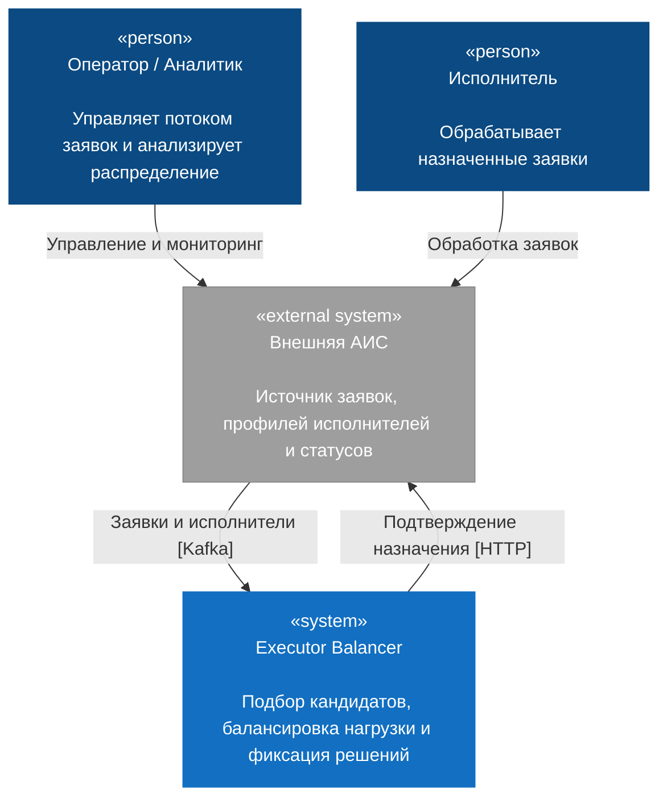
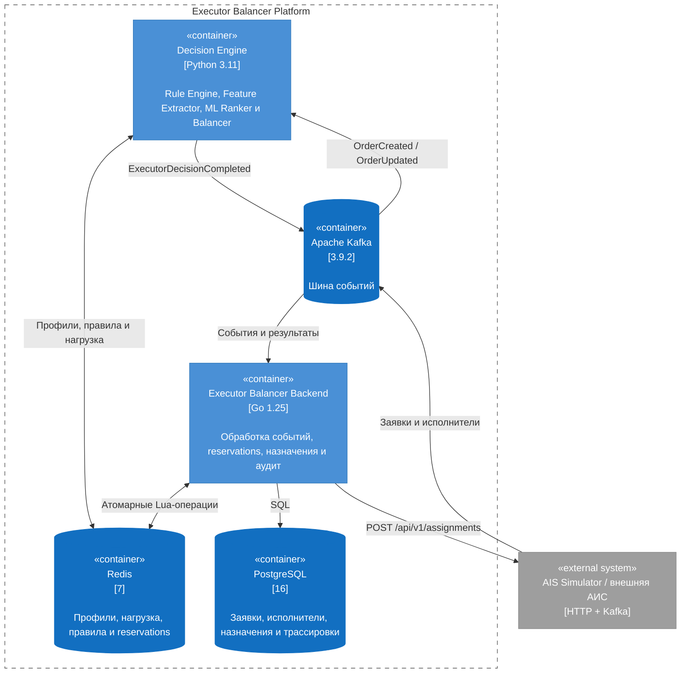
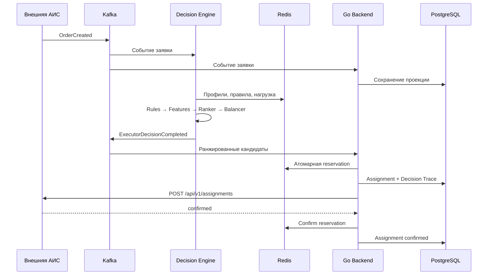

# Executor Balancer

Executor Balancer — событийная система автоматического распределения входящих заявок между исполнителями. Система учитывает параметры заявки, профиль специалиста, квалификацию, доступную емкость и текущую нагрузку.

Проект рассчитан на интеграцию с внешними CRM, ERP, Helpdesk и другими информационными системами, в которых создаются заявки и ведется работа исполнителей.

## Основная идея

Вместо жестко заданного набора условий распределение построено как последовательный конвейер:

```text
Заявка
  → проверка правил
  → извлечение признаков
  → ранжирование исполнителей
  → балансировка по текущей нагрузке
  → атомарное резервирование
  → подтверждение назначения во внешней АИС
```

Такой подход разделяет бизнес-правила, оценку соответствия и технический контроль конкурентных назначений. Новые параметры передаются через расширяемые JSON-атрибуты заявки и исполнителя.

## Архитектура



### Контейнеры системы



## Модули

### Executor Balancer Backend

Go-сервис отвечает за надежное выполнение назначения:

- принимает Kafka-события заявок, исполнителей и результаты Decision Engine;
- поддерживает локальные проекции данных в PostgreSQL;
- хранит оперативную нагрузку исполнителей в Redis;
- атомарно резервирует заявку и исполнителя Lua-скриптами;
- сохраняет Assignment и Decision Trace;
- вызывает API внешней АИС;
- обрабатывает повторы, конфликты и временные ошибки;
- освобождает нагрузку после завершения заявки;
- предоставляет endpoints `/health` и `/ready`.

Исходный код: [`backend/`](backend/).

### Decision Engine

Python-сервис выполняет вычислительную часть распределения:

1. **Rule Engine** фильтрует кандидатов по системным и динамическим правилам.
2. **Feature Extractor** получает признаки заявки и соответствия навыков.
3. **ML Ranker** оценивает релевантность исполнителей.
4. **Balancer** упорядочивает кандидатов с учетом runtime-нагрузки.
5. **Publisher** отправляет ранжированный список в Kafka.

Decision Engine поддерживает ML-модели и эвристические алгоритмы.

Исходный код: [`decision-engine/`](decision-engine/).

### AIS Simulator

FastAPI-приложение эмулирует внешнюю информационную систему:

- CRUD заявок и исполнителей;
- хранение данных в SQLite;
- публикация событий в Kafka;
- прием и подтверждение назначений;
- генерация равномерного потока заявок;
- генерация пиковых нагрузок;
- изменение статусов `processed`, `accept`, `reject`, `await`;
- создание вторичных заявок с `parent_id`;
- изменение активности и capacity исполнителей.

Исходный код: [`simulation/`](simulation/).

### Инфраструктурные модули

- **Kafka** разделяет прием данных, вычисление решения и подтверждение назначения.
- **Redis** хранит профили, runtime-нагрузку, правила, блокировки и reservations с TTL.
- **PostgreSQL** хранит заявки, исполнителей, правила, назначения, Decision Trace и обработанные события.

Миграции: [`backend/migrations/`](backend/migrations/).

## Алгоритм распределения

### Фильтрация

Rule Engine проверяет активность исполнителя, статус и параметры заявки, диапазоны суммы, тип обращения, предмет, признаки клиента и исполнителя, VIP-флаг и динамические условия.

### Ранжирование

Для подходящих кандидатов вычисляется `ml_score`, учитывающий признаки заявки, квалификацию, скорость, надежность, историю обработки и соответствие навыков.

### Балансировка

Основная метрика загрузки:

```text
effective_load = (active_weight + pending_weight) / capacity
```

Кандидаты сортируются по эффективной нагрузке, числу открытых заявок, ML score, количеству обработанных заявок, времени последнего назначения и идентификатору исполнителя.

### Резервирование

Lua-скрипт в Redis атомарно контролирует наличие активного исполнителя, отсутствие другого назначения заявки, отсутствие конкурентной reservation и ограничение `current_load + order_weight <= capacity`.

После успешной reservation создается Assignment, сохраняется Decision Trace и выполняется HTTP-запрос во внешнюю АИС.

## Поток данных



## Технологический стек

| Компонент | Технологии |
|---|---|
| Backend | Go 1.25, pgx, go-redis, franz-go |
| Decision Engine | Python 3.11, aiokafka, redis-py, CatBoost, NumPy, Pandas |
| AIS Simulator | FastAPI, Pydantic 2, SQLAlchemy Async, SQLite |
| Event broker | Apache Kafka 3.9.2, KRaft |
| Runtime storage | Redis 7 |
| Database | PostgreSQL 16 |
| Контейнеризация | Docker, Docker Compose |

## Структура репозитория

```text
request-ranging/
├── backend/
│   ├── cmd/balancer/              точка входа
│   ├── internal/config/           конфигурация
│   ├── internal/integration/ais/  HTTP-клиент внешней АИС
│   ├── internal/repository/       PostgreSQL и Redis
│   ├── internal/services/         бизнес-логика
│   ├── internal/transport/        HTTP и Kafka
│   └── migrations/                миграции PostgreSQL
├── decision-engine/
│   ├── src/decision_engine/
│   │   ├── rule_engine/           правила фильтрации
│   │   ├── feature_extractor/     извлечение признаков
│   │   ├── ml_ranker/             ранжирование
│   │   ├── balancer/              балансировка нагрузки
│   │   └── runtime/               Kafka worker
│   └── tests/
├── simulation/
│   ├── app/api/                   HTTP API
│   ├── app/generator/             генераторы нагрузки
│   ├── app/kafka/                 публикация событий
│   └── app/storage/               SQLite repositories
├── scripts/e2e-smoke.ps1
└── docker-compose.yml
```

## Запуск

Требуются Docker и Docker Compose.

```powershell
docker compose up --build -d
docker compose ps
```

Проверка состояния:

```powershell
Invoke-RestMethod http://localhost:8090/health
Invoke-RestMethod http://localhost:8090/ready
Invoke-RestMethod http://localhost:8091/health
```

Запуск генератора заявок:

```powershell
$body = @{
    mode = "stream_4k"
    target_orders = 10000
    orders_per_hour = 4000
    max_peak_per_sec = 5
    start_lifecycle = $true
} | ConvertTo-Json

Invoke-RestMethod `
    -Method Post `
    -Uri http://localhost:8091/api/v1/simulation/start `
    -ContentType "application/json" `
    -Body $body
```

Сквозная smoke-проверка:

```powershell
.\scripts\e2e-smoke.ps1
```

Остановка:

```powershell
docker compose down
```

## Сетевые адреса

| Сервис | Адрес |
|---|---|
| AIS Simulator API | `http://localhost:8091` |
| AIS Swagger UI | `http://localhost:8091/docs` |
| Backend health | `http://localhost:8090/health` |
| Backend readiness | `http://localhost:8090/ready` |
| Kafka | `localhost:9092` |
| Redis | `localhost:6380` |
| PostgreSQL | `localhost:5442` |

## Kafka topics

| Topic | Назначение |
|---|---|
| `ais.orders.v1` | события заявок |
| `ais.executors.v1` | события исполнителей |
| `decision.result.v1` | результаты Decision Engine |
| `executor-balancer.dead-letter.v1` | DLQ Go-сервиса |
| `decision-engine.dead-letter.v1` | DLQ Decision Engine |

## HTTP API AIS Simulator

| Метод | Путь | Назначение |
|---|---|---|
| `GET` | `/health` | проверка состояния |
| `POST`, `GET` | `/api/v1/orders` | создание и получение заявок |
| `GET`, `PATCH` | `/api/v1/orders/{order_id}` | получение и изменение заявки |
| `POST`, `GET` | `/api/v1/executors` | создание и получение исполнителей |
| `GET`, `PATCH` | `/api/v1/executors/{executor_id}` | получение и изменение исполнителя |
| `POST` | `/api/v1/assignments` | подтверждение назначения |
| `POST` | `/api/v1/simulation/start` | запуск симуляции |
| `POST` | `/api/v1/simulation/burst` | генерация пиковой пачки |
| `POST` | `/api/v1/simulation/stop` | остановка симуляции |
| `POST` | `/api/v1/simulation/seed` | создание начальных данных |
| `GET` | `/api/v1/simulation/status` | статистика симуляции |

## Основные сущности

- `Order` — заявка, статус, вес, версия и расширяемые атрибуты;
- `Executor` — исполнитель, активность, capacity, навыки и runtime-счетчики;
- `Assignment` — назначение заявки исполнителю;
- `Reservation` — временная атомарная блокировка в Redis;
- `DecisionTrace` — трассировка принятого решения;
- `ProcessedEvent` — идентификатор обработанного Kafka-события;
- `Rule` — условие фильтрации кандидатов.

## Команда

Проект разработан командой «Код в сапоге» для хакатона «ТОП ИТ» 2026.
